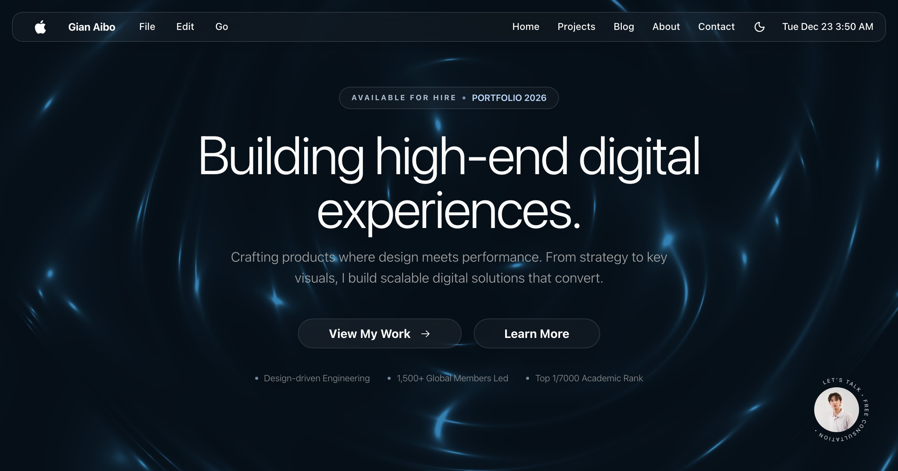

# hey, welcome to my corner of the internet 👋



this is my portfolio. not a template. not a tutorial project. just me figuring out how to make websites that don't suck.

---

## what's this?

a next.js app where i dump everything i've learned about web dev, 3D, motion design, and making things feel *good* to use. been working on this since 2024 and it's basically my digital playground at this point.

**live at:** [gianaibo.tech](https://gianaibo.tech)

---

## the stack (if you care)

- next.js 16 + typescript (yes, strict mode. i hate myself sometimes)
- framer motion + gsap for the buttery animations
- three.js / react three fiber for the 3D stuff
- tailwind v4 + vanilla css
- zod for actually trusting my data

---

## structure

```
├── myportfolio2026/    ← the actual app lives here
├── desaign/            ← mockups, assets, random design files
└── Applications/       ← experiments that may or may not work
```

---

## backstory

graduated CS in 2025, spent 6 months backpacking and freelancing (seo, design, random ai stuff) to fund the trip. this portfolio is what happens when you have too much free time on buses and in hostels.

now looking for actual work lol

---

## wanna chat?

- site: [gianaibo.tech](https://gianaibo.tech)
- linkedin: [/in/gianaibo](https://linkedin.com/in/gianaibo)
- ig: [@gian_aibo](https://instagram.com/gian_aibo)

---

made with mass amounts of coffee and questionable sleep schedules ☕
